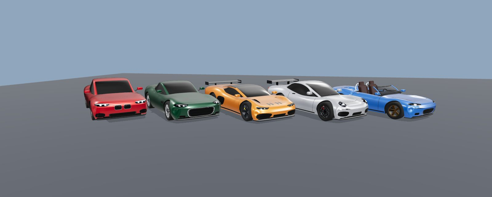
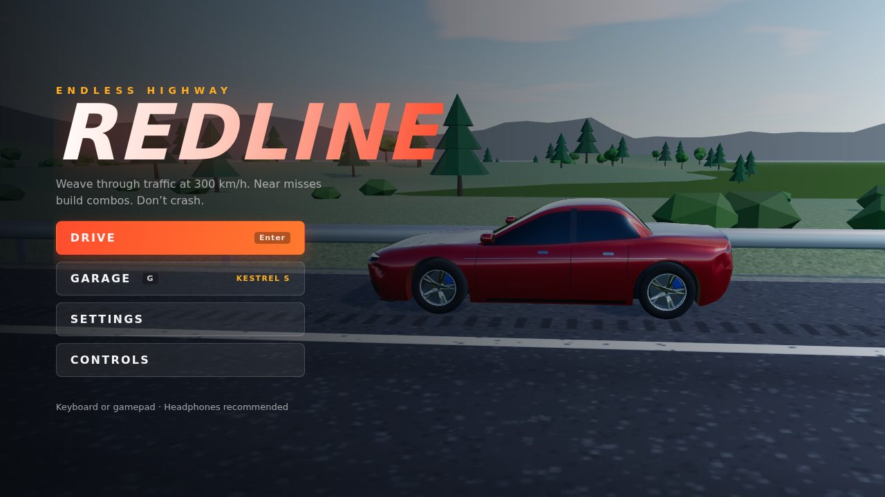
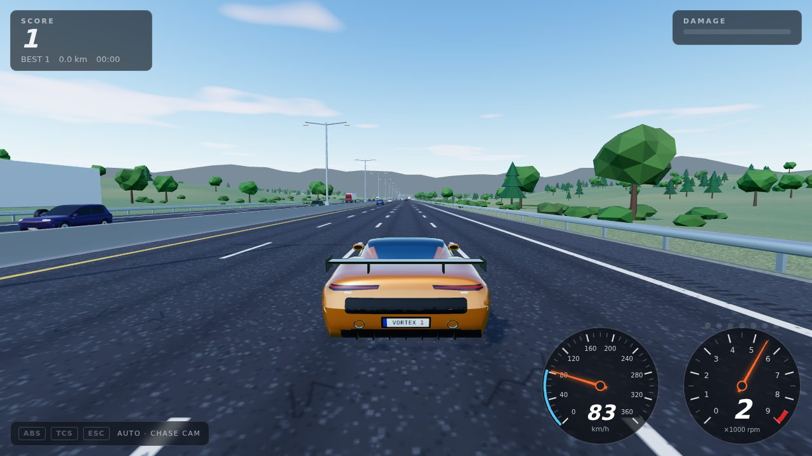
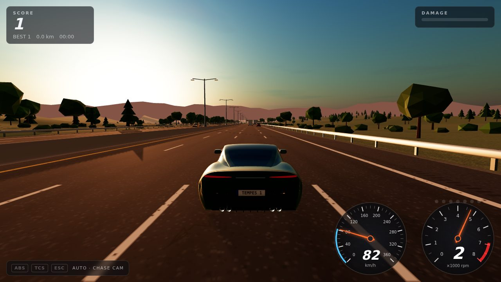
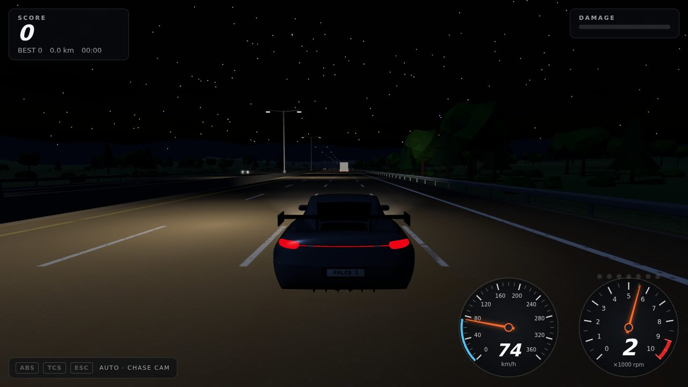
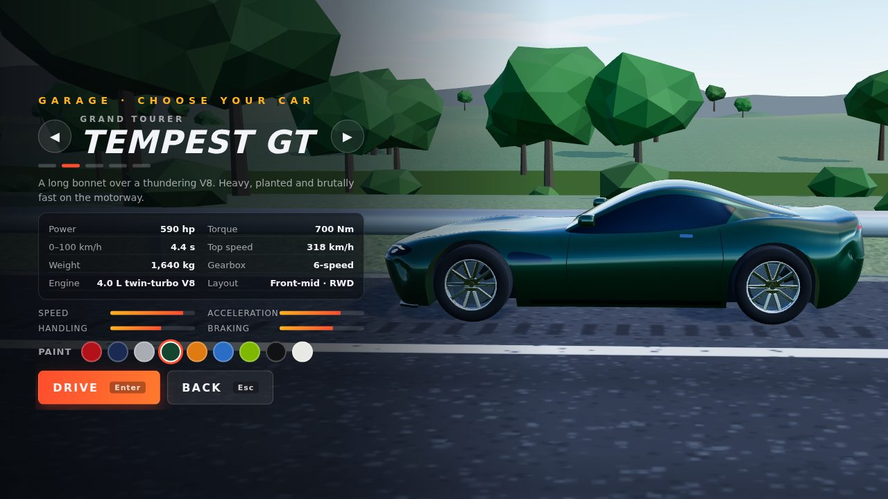
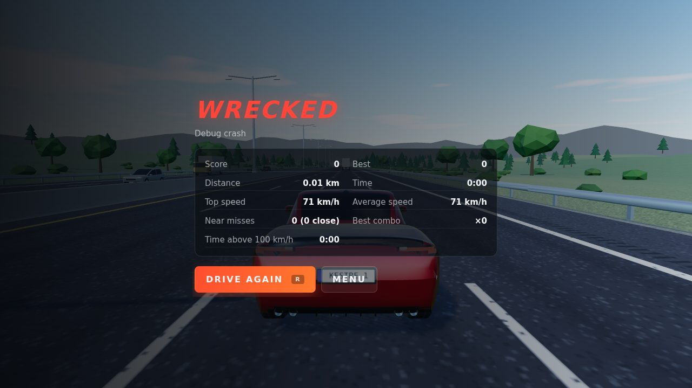
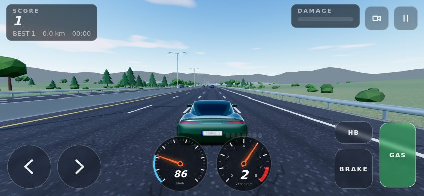
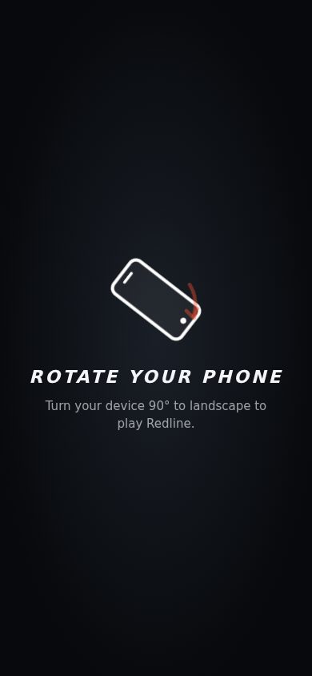
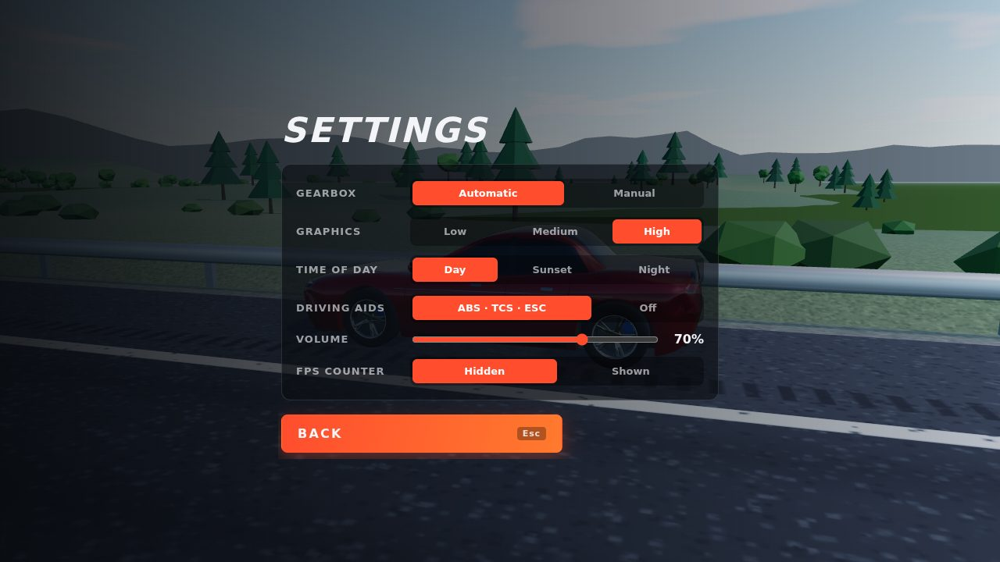

# Redline — Endless Highway

A realistic 3D endless-highway driving game that runs in the browser. Pick one
of five sports cars in the garage and weave through traffic at up to 322 km/h on
an infinite, procedurally generated motorway. It plays with a keyboard, a
gamepad or a phone's touch screen in landscape. There are no downloads or
external assets: every model, texture and sound is generated in code.





| Day | Sunset | Night |
| --- | --- | --- |
|  |  |  |

| Garage | Game over |
| --- | --- |
|  |  |

| Phone in landscape: touch controls | Phone in portrait |
| --- | --- |
|  |  |

## The cars

Open the **GARAGE** from the title screen (or press **G**), flip through the
cars with **◀ ▶** (← → / A D on a keyboard) and pick a paint. Each car
remembers its own paint. Drag the car to spin it.

| Car | Type | Power | 0–100 km/h | Top speed | Weight | Character |
| --- | --- | --- | --- | --- | --- | --- |
| **Kestrel S** | Sports sedan, front engine | 400 hp twin-turbo I6 | 4.7 s | 282 km/h | 1,480 kg | The balanced all-rounder (the original car) |
| **Tempest GT** | Grand tourer, front-mid V8 | 590 hp | 4.4 s | 318 km/h | 1,640 kg | Heavy, torquey and planted at speed |
| **Vortex V10** | Mid-engine supercar | 640 hp, 8,700 rpm V10 | 3.6 s | 322 km/h | 1,470 kg | Fastest in the garage, sharpest turn-in |
| **Falco 6 RS** | Rear-engine coupé | 525 hp, 9,000 rpm flat six | 3.5 s | 306 km/h | 1,440 kg | Huge traction and braking, lively tail |
| **Sprite R** | Roadster, open top | 300 hp turbo I4 | 4.9 s | 254 km/h | 1,180 kg | Slowest on the straights, most agile |

All five are rear-wheel drive. Each has its own mass, weight distribution,
torque curve, gearing (6 or 7 speeds), tires, brakes, aero and engine sound
(four, six, eight and ten cylinders fire at different pitches). The figures
above are what the simulation actually does: `tests/catalog.test.ts` checks
them.

## Playing on a phone or tablet

- The game runs in **landscape**. In portrait, a full-screen prompt with a
  turning phone asks you to rotate the device 90°, and the game stays hidden
  (a run in progress pauses) until you do.
- **Touch controls** appear while driving: **◀ ▶** steering at the bottom
  left (slide your thumb between them), **GAS** and **BRAKE** pedals at the
  bottom right with **HB** (handbrake) above, **+ / −** shift buttons with
  the manual gearbox, and camera and pause buttons at the top right. Every
  control is multi-touch, so you can hold gas, steer and handbrake together.
- **Tilt steering:** Settings → Steering → *Tilt phone* steers by rolling the
  phone like a steering wheel. iPhones ask for motion permission the first
  time.
- Tapping **DRIVE** goes fullscreen and locks the screen to landscape where
  the browser allows it (Android Chrome). On an iPhone, *Share → Add to Home
  Screen* gives a fullscreen, landscape web app.
- The menus, HUD and gauges switch to a compact layout on short landscape
  screens and keep clear of notches and rounded corners.

## How to play

- Press **Enter** (or click **DRIVE**) on the title screen. The run starts
  rolling at 70 km/h in the middle of the motorway.
- **Score** comes from distance (1 point per 10 m). Above **100 km/h** a
  speed multiplier applies: ×2 at 200 km/h, ×2.8 at 280 km/h, ×3.2 at
  320 km/h.
- **Near misses:** overtake a car with less than 1.2 m between your sides to
  score 150 × your combo. Each near miss within 4.5 s grows the combo, up to
  ×10. A **close call** (under 0.5 m) pays 50 % more. Any contact breaks the
  combo.
- **Damage:** light bumps and barrier scrapes add damage, and the car
  physically reacts (lost speed, spins). A hard hit ends the run: more than
  about 40 km/h of closing speed into traffic, or about 49 km/h into a
  barrier. So does 100 % damage.
- Traffic gets denser and faster the longer you survive: light traffic at
  first, rush hour after about 7 minutes.
- Your best score is saved in the browser (`localStorage`).

### Controls

| Action | Keyboard | Gamepad |
| --- | --- | --- |
| Throttle | W / ↑ | Right trigger (analog) |
| Brake / reverse | S / ↓ | Left trigger (analog) |
| Steer | A D / ← → (ramped, not instant) | Left stick (analog) |
| Handbrake | Space | B / X |
| Shift up (manual gearbox) | Shift / E | RB |
| Shift down (manual gearbox) | Ctrl / Q | LB |
| Camera: chase / hood | C | Y |
| Pause | Esc / P | Start |
| Restart instantly | R | Back / View |
| Fullscreen | F | — |
| Garage (title screen) | G, then ← → | — |

Notes:

- With the automatic gearbox, holding brake at a standstill engages reverse,
  and the brake pedal then drives backwards.
- Steering is speed sensitive. At 250 km/h you get only a few degrees of lock,
  so small taps change lanes.
- **Ctrl+W:** holding W and pressing Ctrl can close the tab in some browsers.
  Use **Q/E** to shift, or play in fullscreen (**F**). In fullscreen the game
  locks the keyboard so browser shortcuts can't fire. The game also asks
  before leaving a run in progress.

### Settings

Gearbox (automatic/manual), steering on touch screens (buttons/tilt),
graphics quality (low/medium/high), time of day (day/sunset/night, with
working headlights at night), driving aids (ABS, TCS and ESC on or off),
volume and FPS counter. The selected car and each car's paint are chosen in
the garage. Settings are saved automatically.



## Run locally

Requires Node.js 20+ (22 recommended).

```bash
npm install
npm run dev        # http://localhost:5173
```

Other scripts:

```bash
npm test           # Vitest unit tests (vehicle model, traffic AI, road, collisions, scoring)
npm run typecheck  # TypeScript strict type check
npm run build      # type check + production build into dist/
npm run preview    # serve the production build locally
```

URL options, useful for testing or sharing a look:

| Parameter | Effect |
| --- | --- |
| `?quality=low\|medium\|high` | Override the graphics quality |
| `?tod=day\|sunset\|night` | Override the time of day |
| `?view=orbit` | Orbit camera around the car |
| `?start=8000000` | Start 8,000 km down the road, millions of metres from the world origin (floating-origin demo) |
| `?touch` | Forces the touch controls on (for testing on a desktop) |
| `?debug` | Exposes `window.redline` (state, speed, score, forced crash, car selection) for automated browser tests |

`npm run dev` also serves a car viewer for working on the models:
`/dev/cars.html?car=vortex` shows one car from four angles (`&view=low`,
`&view=side`, … for one view, `&night` for lit lamps, `&matte` to judge the
surfaces without reflections), `?traffic=suv` shows a traffic car and
`?lineup&view=lineup` shows all five.

## Deploy to GitHub Pages

The repository includes `.github/workflows/deploy.yml`. On every push to
`main` it installs dependencies, runs the unit tests, builds the game and
publishes `dist/` to GitHub Pages. Vite's `base` is `./`, so the build works
at any path, including `https://<user>.github.io/<repo>/`.

One-time setup:

1. Push this repository to GitHub, with the code on the `main` branch.
2. On GitHub, open the repository's **Settings → Pages**.
3. Under **Build and deployment → Source**, choose **GitHub Actions**.
4. Push to `main`, or run the workflow manually from the **Actions** tab
   ("Deploy to GitHub Pages" → **Run workflow**).
5. When the workflow finishes, the site URL appears on the workflow run and
   in **Settings → Pages**. It is usually `https://<user>.github.io/<repo>/`.

## How it works

### Architecture

```
src/
  core/      Game (state machine + main loop), FixedStepLoop, Scoring, Settings, math, seeded RNG
  vehicle/   VehicleConfig (tuning of the Kestrel), CarCatalog (the five cars), Engine, Gearbox,
             Tire, VehiclePhysics
  physics/   Collision (2D oriented boxes + impulses), VehicleBody (car ↔ collision body)
  input/     Input (keyboard, gamepad, touch buttons and tilt; steering and pedal ramps)
  world/     RoadPath (procedural centerline), RoadChunk/ChunkManager (recycled chunks),
             Terrain, SceneryModels, Environment (sky, light, fog), World (floating origin)
  traffic/   TrafficAI (IDM, lane-change rules), TrafficCar, TrafficManager (spawning, pooling,
             collisions, near misses), TrafficTypes + TrafficModels (procedural models),
             TrafficRenderer (instancing)
  render/    Renderer (quality profiles), CarModel (player car), CameraRig, Effects, Textures
    car/     Procedural car kit: Profile (smooth design curves), Body (lofted body + glasshouse),
             GridMesh (mesh + creased normals), Decal (surface projection), CabinMask (windows),
             Wheel, Parts (mirrors, wings, exhausts, …), Designs (the five bodies)
  audio/     AudioEngine (Web Audio synthesis)
  ui/        Hud (canvas gauges), Menus (incl. garage), TouchControls, RotateOverlay, styles.css
dev/         Car viewer (dev server only)
tests/       Vitest suites
```

### Procedural cars

Every car is generated from a design in `src/render/car/Designs.ts`, placed
relative to its own physics dimensions so the bodywork always wraps the
simulated wheels:

- **Lofted body:** smooth side-view lines (hood, deck, underside), plan-view
  width and fender crowns are sampled through superellipse cross-sections.
  The front and rear corners are pulled back in plan view, so bumpers wrap
  around. Wheel arches cut real openings with wells behind them, and normals
  are split at a crease angle so arch lips and panel edges stay crisp.
- **Glasshouse:** a second loft for the windscreen, roof and rear window. The
  windows, pillars and seals are painted into a texture laid out along the
  shell, so they're always symmetric and follow the glass exactly.
- **Surface decals:** headlights (housings, projectors, LED running lights),
  taillights, grilles with a honeycomb mesh, intakes, vents, shut lines,
  handles and number plates are 2D outlines projected onto the body, so
  they hug its curves.
- **Parts:** detailed wheels (lathed tires with tread grooves, six spoke
  designs with dished faces, brake discs and calipers), aero mirrors, rear
  wings, splitters, diffuser strakes, exhausts, wipers, and for the roadster
  a windscreen, roll hoops, seats and dashboard.
- **Traffic:** hatchbacks, sedans and SUVs use the same generator at a
  coarser resolution (about 8k triangles each) and are drawn with instancing.

### Physics: a custom vehicle model instead of Rapier

Rapier's raycast vehicle is a port of Bullet's. Its tire model is a friction
clamp, so it can't produce convincing understeer, trail-braking slides or
handbrake turns, and it gets jittery at 280 km/h. It would also need WASM
loading, plus road colliders re-created as the floating origin moves. This
game uses its own model instead:

- **Fixed timestep:** physics runs at 120 Hz regardless of frame rate, with
  two vehicle substeps, and rendering interpolates between steps. A unit test
  checks that 30 fps and 144 fps give identical trajectories.
- **Road-relative (Frenet) frame:** the car lives in (distance along road,
  lateral offset, heading relative to road). Guardrails, lanes and traffic are
  trivial in this frame, and the simulation never touches large world
  coordinates.
- **Four wheels with a combined-slip tire model:** slip ratio and slip angle
  are normalised by their peaks and combined, and a Pacejka-style curve gives
  the total force. This forms a friction circle, so braking while steering
  really does lose grip, and a locked wheel has almost no lateral grip left.
  Tire load sensitivity makes weight transfer matter.
- **Implicit wheel-spin solve:** stable wheelspin, lock-ups, ABS and traction
  control at any speed. The engine inertia is reflected through the gearbox.
- **Engine:** an interpolated torque curve, engine braking, clutch slip at
  launch and a hard-cut rev limiter.
- **Gearbox:** 6 or 7 speeds plus reverse, with shift time, automatic logic
  (throttle-dependent shift points, kickdown, no gear hunting) and manual mode
  with over-rev protection.
- **Weight transfer:** sprung-mass pitch, roll and heave spring-dampers drive
  the load transfer. The nose dips under braking, squats under acceleration
  and the body rolls in lane changes, and the tires feel it.
- **Aero drag and downforce, rolling resistance, road grade and vertical
  curvature.**
- **Speed-sensitive steering:** lock is limited to roughly what the tires can
  use. Entering a corner too fast pushes the front tires past their peak and
  the car understeers.
- **Collisions:** 2D oriented-box contacts with iterative impulses, restitution
  and friction. Off-centre hits spin the car, and traffic cars become sliding
  wrecks with hazard lights.

### World

- A seeded centerline of straights, clothoid transitions, 900–3000 m radius
  curves and gentle grades (up to 4 %), generated on demand into a bounded
  ring buffer.
- 96 m chunks are recycled as the car moves. Each holds both carriageways,
  lane markings, rumble strips, a concrete median, W-beam guardrails, terrain
  with ditches and hills, instanced trees, lamp posts, sign gantries and
  overpasses. No geometry is allocated while driving.
- **Floating origin:** render space is re-centred every 1.5 km. The
  `?start=8000000` option demonstrates it staying stable 8,000 km from the
  origin.

### Traffic

- Cars, hatchbacks, SUVs, vans, box trucks and semis, each with its own size,
  mass, speed range and allowed lanes. Trucks keep right.
- Car following uses the **Intelligent Driver Model**.
- **MOBIL-style lane changes:** a safety check and politeness rule, a
  keep-right bias, turn signals before moving over, and a small share of
  careless drivers who misjudge fast cars coming up from behind.
- Vehicles are pooled and rendered with instancing, so all traffic costs
  about 40 draw calls. Oncoming traffic runs on the other carriageway.

### Audio

Everything is synthesized with the Web Audio API:

- **Engine:** a harmonic oscillator stack following each car's firing
  frequency (rpm/60 × cylinders/2, so the V10 screams and the V8 burbles),
  with load-dependent distortion and filtering, intake roar and lift-off
  pops.
- **Tires and road:** screech, wind, road roar, rumble strips and barrier
  scrapes.
- **Traffic:** four doppler-shifted, stereo-panned voices, plus horns.
- **One-shots:** shift, crash and near-miss whoosh sounds.

## Tuning the cars

The Kestrel's handling values live in `src/vehicle/VehicleConfig.ts`
(`DEFAULT_VEHICLE`). The other four cars in `src/vehicle/CarCatalog.ts`
start from it and override what makes them different. If you retune a car,
update its garage specs too: `npm test` simulates every car and fails if
the advertised 0–100 km/h time, top speed or peak power no longer match.
The most useful values:

| Value | Default | Effect |
| --- | --- | --- |
| `mass` | 1480 kg | Heavier = slower to accelerate, brake and turn |
| `cgToFront` | 1.30 m | Moves the centre of gravity. Smaller = more front weight = more understeer |
| `cgHeight` | 0.50 m | Higher = more weight transfer, dive, squat and roll |
| `yawInertia` | 2350 kg·m² | Higher = lazier, more stable rotation |
| `tireMu` | 1.10 | Overall grip (≈1.1 g cornering, 35 m braking from 100 km/h) |
| `tireShape` | 1.41 | Grip left when sliding (sin(C·π/2) ≈ 80 %). Higher = snappier breakaway |
| `tirePeakSlipAngleFront` / `Rear` | 0.14 / 0.095 rad | Front/rear cornering stiffness. A bigger front value = more stable, more understeer |
| `frontGrip` / `rearGrip` | 1.00 / 1.08 | Per-axle grip balance. Raise front for more turn-in, lower rear for looser |
| `tireLoadSensitivity` | 0.12 | How much weight transfer costs grip. Drives limit understeer |
| `frontRollShare` | 0.64 | Share of roll stiffness at the front. Higher = more understeer |
| `torqueCurve` | 180–480 Nm | Engine output vs rpm (≈300 kW / 400 hp at 6800 rpm) |
| `redlineRPM` / `limiterRPM` | 7200 / 7500 | Tach redline, automatic shift point, fuel cut |
| `gearRatios`, `finalDrive` | 3.80 … 0.84, 3.62 | Gearing: acceleration vs top speed |
| `shiftTime` | 0.18 s | Clutch-open time per shift |
| `autoUpshiftRPM`, `autoDownshiftRPM` | 7050 / 4300 | Automatic shift points at full throttle (kickdown) |
| `dragArea` | 0.84 m² | Cd·A. Main top-speed limiter (≈280 km/h) |
| `downforceArea`, `aeroBalanceFront` | 0.32, 0.38 | High-speed grip and its front/rear split |
| `maxBrakeTorque`, `brakeBias` | 9200 Nm, 0.66 | Brake strength and front share |
| `handbrakeTorque` | 4200 Nm | Enough to lock the rears at any speed |
| `maxSteerAngle` | 0.60 rad | Steering lock at walking pace |
| `steerLateralAccel`, `steerSlipAllowance` | 14 m/s², 0.095 rad | Speed-sensitive steering. More = more lock at speed (twitchier) |
| `steerRate` | 1.0 rad/s | How fast the road wheels can turn |
| `pitchStiffness`, `rollStiffness` (+ damping) | 170 k / 105 k Nm/rad | Softer = more visible dive, squat and roll |
| `absSlipTarget`, `tcsSlipTarget` | 0.9, 1.1 | Driver-aid slip targets (fractions of the tire's peak) |
| `escYawGain`, `escMaxYawMoment` | 6 /s, 6000 Nm | How hard stability control catches slides |

Keyboard feel lives in `src/input/Input.ts`: steering ramp rates (3.4/s at low
speed down to 1.5/s at high speed) and pedal ramp rates. Game-level values,
such as crash thresholds, start speed and scoring, live at the top of
`src/core/Game.ts` and in `src/core/Scoring.ts`.

## Performance

- Graphics quality scales pixel ratio, shadows (off / 2048 / 4096), draw
  distance (900 / 1400 / 2000 m), scenery density, sky clouds, MSAA and
  headlight spotlights.
- Traffic, trees, posts, poles and effects are instanced. Road chunks,
  vehicles and particles are pooled, so there are no allocations while
  driving.
- CPU cost is small. Vehicle physics takes about 14 µs per 120 Hz step,
  traffic about 10–20 µs per step, and building a chunk about 1.3 ms (roughly
  once per second at top speed, spread over frames).
- The player's car is about 75k triangles and takes a few hundred
  milliseconds to build. The other cars are built in the background while
  the title screen idles, so the garage switches instantly.
- On phones the game stops rendering while the rotate prompt is up.

If an older laptop or phone struggles, choose **Low**. It turns off shadows
and clouds, renders at 0.75× resolution and shortens the draw distance.
